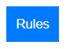

# Ring of Fire - Project Portfolio 2 - JavaScript

In this website you can play a simplified version of the Ring of Fire game!

The purpose of this website is to liven up the party with a fun game! No need to bring a physical deck of cards to your next party!

Link to live site here: <a href="https://eddwer.github.io/ring-of-fire/">Ring of Fire</a>

## Target Audience

The target audience for this website is friends groups who wants to play a fun game together.

## Features

#### Participants

The players are able to choose the amount of participants, as well as choose a name for each participant.

### Rules

By clicking on the "Rules" button, a box pops up where the user can read through all the rules of the game.

## Future features

1. Getting an actual card deck in the game.
2. Making the game area circular, with a fire animation around it.
3. Some design changes to make the game more appealing.

Unfortunately I ran out of time and needed to revert to a more simplistic version of what I was working on, hence the above features were removed.

## Manual Testing

<strong>Features Testing</strong>

| Feature | Action | Effect |
| ------------- | ------------- | ------------ |
| Participant amount | Choose between 2 and 15 | Working correctly |
| Submit button | Click to submit participation amount | Submits participation amount |
| Rules button | Click to display list of rules | Displays list of rules |
| Start game button | Click to start game | Starts game |
| Quit game button | Click to quit game | Quits games ||

<strong>Lighthouse</strong>

<b>Test Scores:</b>

* Performance: 100
* Accessibility: 96
* Best Practices: 100
* SEO: 91

Results: Overall the scores are great. 

<strong>Browsers</strong>

<b>Supported Browsers and Devices</b>

* Google Chrome
* Mozilla Firefox
* Microsoft Edge
* Safari (Iphone)

<b>Responsiveness testing</b> Manual testing has been conducted on all the above browsers.

<b>Screen Sizes testing</b>

| Device/Screen Size  | Performance |
| ------------- | ------------- |
| Desktop (1920x1080) | No issues |
| Laptop (1366x768) | No issues |
| Tablet (iPad) | No issues |
| Mobile (iPhone X) | No issues |

<strong>Known Issues</strong>

* None!

## Bugs

Bug #1: When quitting and starting a new game, buttons would show almost intertwined. Solved this by creating a margin between them.

Bug #2: When quitting and starting a new game, the previous participant amount would stack ontop of the new amount. Solved this by creating a while-loop that skips over any empty players.

Bug #3: When quitting and starting a new game, the Start game and Quit game buttons would sometimes duplicate. Fixed this by adding code to delete the Start game button in the Start game function, and removing the Quit game button in the Quit game function.

<strong>Validator Testing</strong>

* HTML - No errors found. Validated via: https://validator.w3.org/nu/

* CSS - No errors found when validating via: https://jigsaw.w3.org/css-validator/validator

* JavaScript - No errors found. Validated via: https://jshint.com/

## Deployment

Project was deployed to GitHub pages. The steps to deploy are as follows:
* In the GitHub repository, navigate to the Settings tab
* From the source section drop-down menu, select the Main Branch
* Once the main branch has been selected, the page will be automatically refreshed with a detailed ribbon display to indicate the successful deployment.

After site was deployed, it was changed a total of 0 times. Project is now complete.

## Credits

Image used for favicon: https://gauger.io/fonticon/

Images used for playing card images where all taken from https://pixabay.com/ * *SCRAPPED IN THIS VERSION* *

Code for creating a ring of flames around game area was created with the help of ChatGPT * *SCRAPPED IN THIS VERSION* *

<b>No copyright fringement intended. This content is meant for educational purposes only.</b>